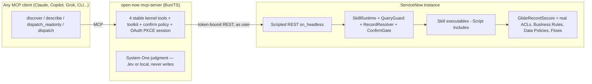

# Open Now — action kernel of NowOS

Open Now is a headless MCP interface for ServiceNow: a small, stable MCP kernel, a curated skill catalog that encodes how real work is done (ITSM/CMDB/ITOM/SPM/CSM/HRSD/SecOps/platform), a generated toolkit for metadata-driven table/record/script access, and an in-instance runtime (`sn_headless` scoped app) that keeps every read and write inside ServiceNow's ACL, Business Rule, and Data Policy fabric.

**The invariant:** the AI client orchestrates; ServiceNow remains the governed system of action. The kernel is protocol only — all capability, permission, and audit logic runs in the instance as the invoking user. No Table API in the kernel, no service account on the interactive path.

We are building toward **[NowOS](docs/nowos.md)**: composable surfaces *outside* the ServiceNow UI, with this repo as the only mutation path.

> Design spec: [`docs/spec.md`](docs/spec.md) · Wire contract: [`docs/wire-contract.md`](docs/wire-contract.md) · Implementation plan: [`docs/implementation-plan.md`](docs/implementation-plan.md) · Judgment plane: [`docs/judgment.md`](docs/judgment.md) · NowOS: [`docs/nowos.md`](docs/nowos.md)

---

## How it fits together



Three components, one contract (`packages/contracts`):

| Component | Path | What it owns |
|---|---|---|
| MCP kernel | `packages/mcp-server` | The four tools, confirmation protocol, OAuth/PKCE, sessions, domain modes, internal System One judgment |
| Instance runtime | `instance/sn_headless` | Skill registry, audit, discover index, query guard, planners/appliers (scoped app update set) |
| Skill catalog | `packages/skill-docs` | 32 validated skill documents (the contract source of truth; seeded into the registry) |

---

## Quickstart (PDI or subprod)

1. **Build the app** — `bun run build:app` produces `dist/sn_headless/update-set.xml`.
2. **Install it** — System Update Sets → Load XML, then activate the `sn_headless` scope. Full PDI walkthrough: [`instance/bootstrap/README.md`](instance/bootstrap/README.md).
3. **Create an OAuth app** in the instance (System OAuth → Application Registry): grant type **Authorization Code**, **PKCE enabled**, redirect URI = your server URL + `/oauth/callback`. Copy the client id.
4. **Configure the server** (env or `--config file.json`; see [Configuration](#configuration)).
5. **Seed the catalog** — `bun run seed` (imports all 32 skill documents into the registry; `--dry-run` to preview).
6. **Run** — stdio for local/builder use, HTTP for interactive clients:
   ```bash
   # stdio (static per-user token)
   OPEN_NOW_INSTANCE_URL=https://dev123456.service-now.com \
   OPEN_NOW_ACCESS_TOKEN=<your-token> \
   bun run packages/mcp-server/src/bin/open-now.ts --transport stdio

   # http (per-user OAuth sign-in)
   OPEN_NOW_INSTANCE_URL=https://dev123456.service-now.com \
   OPEN_NOW_OAUTH_CLIENT_ID=<client-id> \
   bun run packages/mcp-server/src/bin/open-now.ts --transport http
   ```
7. **Connect a client** — e.g. Claude Desktop (`claude_desktop_config.json`):
   ```json
   {
     "mcpServers": {
       "open-now": {
         "command": "bun",
         "args": ["run", "packages/mcp-server/src/bin/open-now.ts", "--transport", "stdio"],
         "env": {
           "OPEN_NOW_INSTANCE_URL": "https://dev123456.service-now.com",
           "OPEN_NOW_ACCESS_TOKEN": "<your-token>"
         }
       }
     }
   }
   ```
   In HTTP mode the client signs in at `/oauth/authorize`; each MCP session is bound to the resulting user token. Pass the session via the `Mcp-Session-Id` header or `Authorization: Bearer <sessionId>` (the `/oauth/token` endpoint mints the session id as an opaque token).

### One quick check

```bash
bun run eval -- --gateway mock   # 9 golden steps, no instance required
```

---

## Using the tools

The kernel tool surface is intentionally four stable tools (spec §3.3); the action surface grows behind them — via the 32-skill catalog and the generated toolkit (see below) — so the model context never has to absorb hundreds of tool descriptions.

**Default surface: 4 kernel tools + 32 curated skills + 10 generated toolkit tools.** In table mode (`OPEN_NOW_TOOLKIT=table`) the toolkit expands to ~125 per-table tools; everything still routes through one instance-side trust boundary.

| Tool | Purpose |
|---|---|
| `discover` | Semantic/intent search over the skill index. Returns ranked skill ids + raw-operation fallbacks with a one-line why. |
| `describe` | The technical contract: inputs, tables, roles, confirmation policy, related skills. **Required before dispatch for write-class skills.** |
| `dispatch_readonly` | GET-equivalent only. Reads, aggregates, relationship walks, KB search. Never mutates. |
| `dispatch` | Invoke a skill. Confirmation policy enforced: write-class returns a pending diff unless `confirm: true` with the same `requestId`; then it applies exactly once. Raw operations use `skillId: "raw:<table>"`. |

### Example flow

```text
discover("server down for the app team")
  → sn.cmdb.ci.find [0.9], sn.itsm.incident.triage [0.8], raw:incident [0.05]

describe("sn.itsm.incident.update")
  → { inputs: { incident_number, mode: comment|work_note|resolve, ... }, confirmation: update_owned, ... }

dispatch("sn.itsm.incident.update", { inputs: { incident_number: "INC0010001",
           mode: "resolve", resolution_code: "fixed", resolution_notes: "rebooted" } })
  → { outcome: "pending", diff: [ { field: "state", before: "1", after: "6" }, ... ],
      auditId: "...", requestId needed for confirm }

dispatch("sn.itsm.incident.update", { inputs: {...}, confirm: true, requestId: "<same id>" })
  → { outcome: "applied", focusedPayload: { record_numbers: ["INC0010001"] } }
```

**Write semantics:**

- `read` — answered directly, never confirmed.
- `update_owned` + `autoApply` policy + record owned by caller — applied silently (policy is declared in the skill document; the kernel/registry enforce it).
- everything else — `pending` with a field diff (or draft for create-class) until confirmed.
- `resolve` mode requires `resolution_code` + `resolution_notes`; missing inputs come back as `outcome: "error"` with `missingFields`.
- same `requestId` twice → Server replays the settled outcome; the applier never runs twice.
- `GraphQL`-shaped risk: HR/SecOps skills take structured inputs only — an itil user without `sn_hr_core.case_writer` gets `denied` before any HR-table query runs.

### Raw fallback

`dispatch` on `raw:incident` (`{ table, query, fields, limit }`) is the builder escape hatch behind `QueryGuard` (allowlisted operators, capped windows, field allowlists, no `JS:`/`GOTO`). It always shows as a discover candidate but is never the default path for operators.

### Toolkit — the generated wide surface

Beyond the 32 skills, a **generated toolkit** covers any table without hand-written glue — all still executed in the instance through `QueryGuard`/`RecordResolver`/`ConfirmGate`/audit. No Table API in the kernel, no service account, ever.

**Generic mode (default, `OPEN_NOW_TOOLKIT=generic`)** — 10 tools, context-safe, metadata-driven:

| Tool | Behavior |
|---|---|
| `table_list` / `table_schema` | metadata from `sys_db_object`/`sys_dictionary` |
| `record_get` | one record by number or sys_id (role-gated on HR/SecOps tables) |
| `record_create` / `record_update` / `record_delete` | draft/diff first → `confirm:true` + same `requestId` applies exactly once; **deletes are restricted** (never silent) |
| `aggregate_report` | server-side COUNT/AVG/MIN/MAX/SUM, optional groupBy — no row dumps |
| `run_script` | short server-side Glide script, eval'd in the scoped runtime |
| `attachment_list` / `attachment_add` | attachments per record (base64, draft-then-confirm) |

**Table mode (`OPEN_NOW_TOOLKIT=table`)** — NowAIKit-style breadth: `tbl_<table>_{query,get,create,update,delete}` generated per table from `OPEN_NOW_TABLE_TOOLS` (comma list; default is a core ~25-table allowlist → ~125 tools). Everything routes to the same runtime — one audit model, same confirm semantics. Set `OPEN_NOW_TABLE_TOOLS=` to disable, or list exactly the tables you want.

```text
table_schema({ table: "incident" })        → fields from sys_dictionary
record_update({ table: "incident", number: "INC0010001", values: { state: "2" } })
  → pending (field diff) → confirm:true + same requestId → applied (exactly once)
record_delete({ table: "incident", number: "INC0010001" })
  → pending ("Deletes require confirmation") → confirm:true → deleted
run_script({ script: "new GlideRecord('incident').getRowCount()" }) → result
```

---

## Skill catalog

32 skills ship today (all validated against the contracts schema; every doc has a matching `Exec*` planner + applier — enforced by tests):

- **P1 (22):** shift briefing, incident triage/similar/update/major, problem open, change draft/assess-risk/CAB-prep/implement, request submit/fulfill, SLA at-risk, ITOM alert triage/correlate, CMDB CI find/blast-radius/service health, SPM portfolio, KB answer, my work, safe aggregate.
- **P2 (10):** SPM project prep, CSM case briefing/update, HRSD case handle, SecOps SIR/vuln, platform schema describe, update set review, script impact, flow run.

**Adding a skill:** create `packages/skill-docs/src/sn.<domain>.<obj>.<verb>.json` (strict schema — `SkillDoc` in `packages/contracts`; one executable ref naming the domain `Exec*` class and `plan_/apply_` methods), implement the method in the matching `instance/sn_headless/script-includes/Exec*.js`, re-run `bun run build:app && bun run seed`. `bun test tests/unit/skill-docs.test.ts` + `tests/unit/instance/exec-methods.test.ts` verify the binding.

---

## Configuration

All settings via environment (defaults in parentheses) or `--config file.json` (same keys, camelCase):

| Env var | Purpose |
|---|---|
| `OPEN_NOW_INSTANCE_URL` | Instance URL, no trailing slash (**required**; `SNOW_INSTANCE` also accepted) |
| `OPEN_NOW_TRANSPORT` | `stdio` (default) or `http` |
| `OPEN_NOW_PORT` | HTTP port (default `8787`) |
| `OPEN_NOW_ACCESS_TOKEN` | Static per-user token for stdio mode (`SNOW_ACCESS_TOKEN` alias) |
| `OPEN_NOW_OAUTH_CLIENT_ID` | OAuth application registry client id (http mode) |
| `OPEN_NOW_OAUTH_REDIRECT_URI` | Defaults to `http://localhost:8787/oauth/callback` |
| `OPEN_NOW_OAUTH_SCOPES` | Comma-separated, default `useraccounts` |
| `OPEN_NOW_DB_PATH` | SQLite path for session store (default in-memory) |
| `OPEN_NOW_DOMAIN` | Domain mode: expose only `sn.<domain>.*` skills as `<domain>_<slug>` tools (e.g. `itsm`) |
| `OPEN_NOW_REQUIRE_DESCRIBE` | Hard-require describe before any dispatch |
| `OPEN_NOW_ENABLED_SKILLS` | Comma-separated allowlist |
| `OPEN_NOW_TOOLKIT` | Generated wide surface: `generic` (default) \| `table` \| `off` |
| `OPEN_NOW_TABLE_TOOLS` | Comma-separated table allowlist for table mode (empty = none; unset = core allowlist) |
| `OPEN_NOW_JUDGMENT` | Internal System One: `off` (default) \| `local` \| `jev` — see [`docs/judgment.md`](docs/judgment.md) |
| `TYPESAFE_API_KEY` | Jev API key when `OPEN_NOW_JUDGMENT=jev` (never sent to ServiceNow) |
| `OPEN_NOW_JOURNAL_PATH` | Append-only JSONL of `jev.answered` / `skill.discovered` / `dispatch.*` |

**Pause switch:** each registry row has an `active` flag — a single flip pauses a skill sans deploy.

---

## Development

```bash
bun install
bunx tsc --noEmit                      # typecheck
bun test tests/unit                    # 74 unit tests (kernel, runtime shim, catalog, builder)
bun run eval -- --gateway mock         # golden protocol suite (9 steps, §8.4 cases)
bun run eval -- --gateway instance     # same suite against a real instance (env-gated)
bun run bench                          # latency + token estimate per skill
bun run seed -- --dry-run              # catalog import preview
bun run build:app                      # rebuild dist/sn_headless/update-set.xml
```

CI (`.github/workflows/ci.yml`) runs typecheck + unit tests + app build on every push; the integration job activates when `SNOW_INSTANCE`/`SNOW_ACCESS_TOKEN` secrets are present.

Instance-side tests use a Glide shim (`tests/unit/helpers/glide-shim.ts`) — no instance needed. Real ACL/BR verification runs via `bun test tests/integration` + `--gateway instance` against a PDI (see [`instance/bootstrap/README.md`](instance/bootstrap/README.md)).

---

## Security model (short version)

- Default run-as is the invoking user; no impersonation, per-user OAuth + PKCE.
- Writes fire real Business Rules/Data Policies/Approvals in the instance — the MCP layer never reimplements them.
- Every dispatch writes an audit row (`sn_headless_run`): actor, skill, tables, record numbers, query hash, outcome, latency. A dispatch without an audit line is a failed dispatch.
- Model queries are hostile: `QueryGuard` allowlists operators/caps/fields, rejects `JS:`/`GOTO`.
- Restricted tables (HR/SecOps/Legal) deny by role before any query; deletes are opt-in and off by default.
- `403` is fail-closed: the skill returns `denied` with a reason; the client never retries with a broader query.

---

## Repository layout

```
open-now/
├── README.md                       # this file (usage)
├── docs/                           # spec.md (design), wire-contract.md, evaluation.md, implementation-plan.md
├── packages/
│   ├── contracts/                  # zod schemas + types (single source for both sides)
│   ├── skill-docs/                 # 32 skill documents (catalog source of truth)
│   ├── mcp-server/                 # kernel, gateways, auth, domain modes, CLI, judgment
│   └── client-lib/                 # typed client helpers for MCP hosts
├── instance/
│   ├── sn_headless/                # scoped app: app.json, script-includes/, rest/
│   └── bootstrap/                  # PDI setup guide
├── scripts/                        # build-app, seed, eval-runner, bench, export-update-set
├── tests/                          # unit/, integration/, fixtures/ (goldens, mock gateway)
└── dist/                           # built update set (git-ignored)
```
