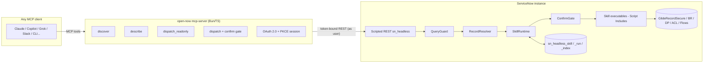

# Open Now — Implementation Plan

**Status:** v1.0 · draft for approval
**Source spec:** `docs/spec.md` (Headless Now v1.0, 16 Sep 2026 — deduped to a single copy during build).
**Scope:** Build Open Now (Headless Now) as an OSS headless MCP interface for ServiceNow, per the `docs/spec.md` architecture and skill catalog.

---

## 1. Summary and locked decisions

| # | Decision | Choice | Rationale |
|---|---|---|---|
| D1 | Runtime home | **Split: thin external MCP protocol layer + in-instance trust runtime (`sn_headless` scoped app)** | Spec §8.2 mandates the scoped app; §4 mandates ACL/BR/DP enforcement in the instance. An external-only server can't honor GlideRecordSecure/query-ACL rules without reimplementing them. |
| D2 | Language/stack | **TypeScript + Bun** (monorepo, `@modelcontextprotocol/sdk`, `bun test`, SQLite via `bun:sqlite` for token/session store) | MCP ecosystem is TS-first; bun is installed on the dev workstation; zero external runtime deps for the session store. |
| D3 | Trust boundary | **All reads/writes go through one instance-side Scripted REST surface** (`/api/now/sn_headless/...`). Table API is never called by the kernel directly — it's what raw-operations use *inside* the guard behind QueryGuard. | Spec §4.3: model-encoded queries are hostile; §3.4: callers never choose the API. |
| D4 | Skill executable v1 | **Server-side Script Includes (scoped).** Flow actions, Now Assist skills, and published subflows are adapters wired *later*, when a customer already owns them. | Script Includes are portable to any release (pre-Zurich included), testable against a PDI, and don't depend on authoring tooling. |
| D5 | Build order | Follow spec §8.1: foundation → read skills → owned writes → creates → domain servers → restricted → builder. | Mirror Claudeforce: trust first, writes later. |
| D6 | Skill design invariant | **Every skill is a Planner + Applier pair.** Planner computes the proposed mutation and diff with zero side effects; Applier executes only on confirm (or auto-apply under policy). | Gives dry-run/confirm for free, makes ConfirmGate policy enforceable in code, and keeps unit tests PDI-free. |
| D7 | MCP hosting | Standalone Node/Bun server (stdio + Streamable HTTP) is the shipped product for v1. MCP Server Console registration is optional and Zurich+ only. | Pre-Zurich instances get the same behavior; the console is a hosting option, not a dependency. |
| D8 | Auth | OAuth 2.0 authorization code + PKCE, public client, per-user sign-in on first use. Token store: SQLite. No client-credentials on the interactive path. | Spec §4.1; PKCE confirmed supported by ServiceNow inbound OAuth. |

**Non-goals for v1:** vector/embedding discover (keyword index first); generative dashboards (client-side); outbound Universal MCP Client; delete skills (opt-in, off by default); multi-tenancy (single-instance config, multi-instance later).

---

## 2. Repository layout

```
open-now/
├── README.md                        # usage doc (this repo's entry point)
├── docs/                            # spec.md (design), wire-contract.md, evaluation.md, implementation-plan.md
│   ├── implementation-plan.md       # this file
│   └── wire-contract.md             # generated API/types reference
├── packages/
│   ├── contracts/                   # zod schemas + TS types (single source for both sides)
│   │   ├── skill-doc/v1.schema.ts   # §5.1 required fields, strict validation
│   │   ├── invoke/v1.ts             # dispatch req/resp, diff, focused payload
│   │   └── audit/v1.ts              # run row shape
│   ├── skill-docs/                  # catalog source of truth: sn.*.json (one per skill)
│   ├── mcp-server/                  # kernel + domain servers (entrypoints per surface)
│   │   ├── src/kernel/              # discover, describe, dispatch_readonly, dispatch
│   │   ├── src/domains/             # sn.itsm, sn.cmdb, sn.itom, sn.spm, ...
│   │   ├── src/auth/                # OAuth PKCE client, token store, session
│   │   └── src/gateway/             # SnowGateway interface + InstanceGateway + MockGateway
│   └── client-lib/                  # optional typed helper for MCP hosts (Claude/Copilot plugins)
├── instance/
│   ├── sn_headless/                 # scoped app update set (exported XML, versioned)
│   │   ├── tables/                  # sn_headless_skill, _run, _index DDL + ACLs
│   │   ├── script-includes/         # SkillRuntime, QueryGuard, RecordResolver, ...
│   │   ├── rest/                    # scripted REST resources
│   │   └── seed/                    # skill registry rows (doc JSON from packages/skill-docs)
│   ├── bootstrap/                   # PDI setup guide + scripts (import update set, seed)
│   └── release-notes.md
├── tests/
│   ├── unit/                        # QueryGuard, RecordResolver, ConfirmGate, schema, payload clampers
│   ├── integration/                 # PDI-tagged (env SNOW_INSTANCE), golden §8.4 suite
│   └── fixtures/                    # MockGateway fixtures + golden prompt JSON
├── scripts/                         # export-update-set, seed, eval-runner, bench
└── package.json                     # bun workspaces
```

---

## 3. Architecture



**Invariant:** the kernel is stateless except OAuth sessions and config. Every capability, every ACL check, every audit write happens in the instance. The kernel never parses encoded queries — QueryGuard does, server-side, with full context.

### 3.1 Instance runtime (`sn_headless` scoped app)

**Tables** (all scoped, `sys_scope = sn_headless`):

| Table | Purpose | Key fields |
|---|---|---|
| `sn_headless_skill` | Skill registry (doc is source of truth) | `id` (dotted unique), `name`, `version`, `status` (draft/ga/deprecated), `persona`, `intent`, `inputs_json`, `tables_read`, `tables_written`, `roles_any_of`, `roles_all_of`, `confirmation` (choice §4.4), `procedure`, `side_effects`, `returns_json`, `related_skills`, `executable` (script_include/flow_action/now_assist/raw), `executable_ref`, `active` (pause switch per skill), `doc_version` |
| `sn_headless_run` | Audit line per dispatch | `skill_id`, `skill_version`, `user` (ref sys_user), `client_app`, `request_id` (idempotency), `inputs_hash`, `tables_touched`, `record_numbers`, `encoded_query_hash`, `outcome` (success/denied/confirmed/aborted/failed), `error`, `latency_ms`, `result_summary`, `confirmed` |
| `sn_headless_index` | Discover corpus (keyword v1) | `entity_type` (skill/table/flow/raw_op), `entity_id`, `term`, `weight` |

ACLs: `skill` read for authenticated users, write for admin; `run` readable by actor (`user = sys_user`) or `security_admin`; `index` read-only to users.

**Script Includes (scoped, client-callable=false):**

- `SkillRuntime` — load doc by id; validate inputs against `inputs_json`; role check (`roles_any_of`/`roles_all_of` via current user, in addition to ACLs); confirmation gate; execute planner/applier; write `sn_headless_run`; enforce focused payload shape (never returns raw GlideRecord).
- `QueryGuard` — parse/validate encoded query: allowlisted operators (`= != < > <= >= IN NOT IN STARTSWITH ENDSWITH CONTAINS LIKE BETWEEN` + `^OR`), reject `JS`/`GOTO`, extract query-field ACL constraints, clamp window (default 25, max 100), enforce per-skill field allowlist instead of `sysparm_fields=*`, normalize + hash the query for audit.
- `RecordResolver` — number → sys_id resolver via GlideRecordSecure (per-table); CI identification (prefer Identification Engine, else exact name+class, else contains-name + class); returns candidates and refuses to guess on ambiguity.
- `ConfirmGate` — classification of proposed mutation per §4.4; builds `diff` (current vs proposed) or `draft` summary; returns `pending=true` + diff for update_shared/create/approve/execute/deploy/restricted; auto-apply only for `update_owned` under policy; idempotent apply keyed on `request_id`.
- `BlastRadius` — depth-capped BFS over `cmdb_rel_ci` (default 2, 3 only for application services; 50-node cap), includes application services/service offerings, flags stale relations.
- `RawExecutor` — fallback for raw operations (builder path): allowlisted table + field set, QueryGuard, cap; always confirmation `update_shared` on write, stricter per spec §10.2.
- Executables: `ExecITSM`, `ExecCMDB`, `ExecITOM`, `ExecSPM`, `ExecKB`, `ExecMe`, `ExecReport`, `ExecHR`, `ExecSecOps`, `ExecPlatform` — each with `plan(id, inputs, ctx)` / `apply(id, plan, ctx)` methods. Feature-detect module/table existence (`sys_db_object`) so ITOM/SPM/CMDB skills degrade gracefully.

**Scripted REST** (scope `sn_headless`, requires OAuth-authenticated user; never impersonates):

| Resource | Method | Purpose |
|---|---|---|
| `/api/now/sn_headless/discover` | GET | `q`, `limit` → ranked `[{id, kind, score, why}]`; raw ops included as candidates, flagged |
| `/api/now/sn_headless/skills/{id}` | GET | describe payload (§5.1 + example B shape) |
| `/api/now/sn_headless/skills/{id}/invoke` | POST | `{inputs, client_app, request_id, dry_run?, confirm?}` → `{outcome, focused_payload, diff?, confirmation, audit_id, next}` |
| `/api/now/sn_headless/raw` | POST | raw operation executor (QueryGuard path) |
| `/api/now/sn_headless/runs/{request_id}` | GET | audit row + idempotency lookup |
| `/api/now/sn_headless/import` | POST | admin-only seed/upsert of skill docs (JSON) |

### 3.2 Kernel (MCP server)

- **Tools (stable surface, 4):** `discover`, `describe`, `dispatch_readonly`, `dispatch` — schema frozen after P2; domain servers expose curated aliases that call the same `/invoke`.
- **Confirmation flow:** `dispatch` on write-class returns `pending: true` + `diff`; host re-invokes with `confirm: true` + same `request_id`; server applies via Applier and logs outcome. `require_describe` config: reject `dispatch` for write-class when describe was skipped (spec §3.3).
- **Auth:** OAuth 2.0 auth code + PKCE (public client). First-use redirect → instance login → token bound to user; refresh rotation; per-user row in SQLite. Optional attended-AI-user mode (`rg`-style flag) uses a named user record with declared roles — never silent.
- **Focus shaping:** clamp listed records to caps (25/100), strip PII fields (`sys_user` body fields, HR case body until asked), return `next` recommended skill from `related_skills`. Never return `sysparm_fields=*`.
- **Config:** `open-now.config.json`/env: instance URL, OAuth client id/secret, enabled skills, `require_describe`, auto-apply policy for `update_owned`, pause per client (combined with `active` flag from registry).

### 3.3 Domain servers

One codebase, separate entrypoints (`open-now --domain sn.itsm` etc.). Each is a thin MCP server exposing 5–15 curated tools that map 1:1 to catalog skills through the same `/invoke` — one audit model (§3.3 Surface B rationale). `sn.itom`/`sn.cmdb`/`sn.spm` same pattern; `sn.hrsd`/`sn.secops` enforce structured inputs and deny raw table access for users without roles.

---

## 4. Security implementation checklist (spec §4 → artifact)

| Spec requirement | Implementation | Verify |
|---|---|---|
| Run as user by default | Scripted REST executes as session user; no `impersonate()` outside unattended flag | Integration: two users, same skill, different ACL outcome |
| Encoded query hygiene | QueryGuard (allowlist, caps, field allowlists, JSLIB reject, hash) | Unit tests: hostile query corpus |
| HR/SecOps: no freeform queries | `sn_headless_skill.structured_inputs=true` → kernel passes only typed inputs; QueryGuard never sees a raw query | Golden §8.4 HR case case |
| Confirmation classes | ConfirmGate + kernel policy; diff-first; dual-confirm on `approve` | Unit + e2e with MCP host |
| Deny on restricted/delete | `restricted` class → skill only if role passes, default deny on delete | Unit |
| Never skip BRs | No `setWorkflow(false)` except named data-fix skills (documented in doc `side_effects` note) | Code review guard in SkillRuntime |
| Audit every dispatch | `sn_headless_run` write is mandatory; failure to write run = failed dispatch | Integration assertion |
| 403 = fail closed | Kernel returns explicit `denied` outcome + reason; no retry with broader query | Unit/Integration |
| Secrets | Server Card stores metadata only; tokens only in SQLite/session | Config review |

---

## 5. Skill document contract (v1)

`packages/skill-docs/sn.<domain>.<object>.<verb>.json`, validated against `packages/contracts` zod schema (strict — missing §5.1 field = CI error). Contains all §5.1 fields plus `structured_inputs`, `feature_deps` (tables/modules), `policy` (auto-apply rules), and `eval` (golden prompt reference). Versioned semver; clients must not cache field lists (spec §5).

Seeding: `instance/sn_headless/seed/` holds one row per doc; `POST /import` upserts by `id + version`, `active=false` for new versions until reviewed (rollout control).

---

## 6. Phases and acceptance criteria

### P0 — Contract and scaffold (~1 wk)
- `git init`, license (Apache-2.0 pending approval), bun workspaces, TS strict, `bun test` skeleton, CI (typecheck + unit + build; integration job gated on `SNOW_INSTANCE`).
- `packages/contracts` v1 schemas (skill-doc, invoke, audit, discover) — frozen.
- Dedupe README (delete lines 3522–6947) and re-export final single copy.
- **Done when:** contracts typed + 5 P1 skill-doc stubs pass schema validation; CI green.

### P1 — In-instance runtime `sn_headless` v0.1 (~2–3 wk)
- Scoped app scaffold; 3 tables + ACLs; Script Includes (SkillRuntime, QueryGuard, RecordResolver, ConfirmGate, RawExecutor); `invoke`/`describe`/`discover`/`run`/`import` REST resources; seed loader.
- Planner/Applier convention enforced (named exports; lint rule).
- PDI bootstrap guide + exported update set.
- **Done when:** on a PDI with 2 test users: `me.work` returns focused payload; user without role on a skill gets `denied`; `?JS:` query rejected; field cap enforced; audit row exists for every invoke; no Table API call outside QueryGuard path.

### P2 — MCP kernel v0.1 (~2–3 wk)
- 4 tools, stdio + Streamable HTTP, OAuth PKCE flow + SQLite session store, confirm gate client policy, request_id idempotency, focused payload shaping, `open-now.config`.
- `SnowGateway` interface: `InstanceGateway` (HTTP) + `MockGateway` (fixture) so kernel tests run PDI-free in CI.
- **Done when:** e2e from MCP Inspector: `discover("server down")` → `describe(sn.cmdb.ci.find)` → `dispatch_readonly` returns candidates; `dispatch(sn.itsm.incident.update, resolve)` with missing `resolution_code` returns diff + pending, then `confirm` applies and returns new state; audit row recorded; 403 surfaced as clean denied result.

### P3 — P1 read skills (trust layer) (~2–4 wk)
Skills (per §8.1 order + P1 catalog): `sn.me.work`, `sn.itsm.shift.briefing`, `sn.cmdb.ci.find`, `sn.cmdb.ci.blast_radius`, `sn.itsm.incident.similar`, `sn.kb.answer`, `sn.itsm.change.assess_risk`, `sn.itsm.sla.at_risk`, `sn.cmdb.service.health`, `sn.itom.alert.triage`, `sn.spm.portfolio.status`, `sn.ops.report.aggregate` — plus remaining P1 read-shaped cards as needed.
Each: doc JSON + Exec planner/apply (plan only) + focused-payload test + golden fixture.
- **Done when:** §8.4 golden cases for these pass; PII allowlists verified (no `sys_user` body in payloads); benchmark note recorded vs Table API baseline.

### P4 — Owned writes (~1–2 wk)
- `sn.itsm.incident.update` (comment/work_note/resolve + close refusal), `sn.csm.case.update`, `sn.itom.alert.correlate` (ack path).
- **Done when:** resolve requires `resolution_code`+`resolution_notes`; work-note on unassigned record → `update_shared` diff; update_owned auto-apply only under policy; wrong-record rate + 403 rate metrics collected in runs.

### P5 — Creates through engines (~2–3 wk)
- `sn.itsm.request.submit` (Catalog API, variable contract, record-producer path), `sn.itsm.change.draft` (standard-change producers, `task_ci`, CI required unless doc-only), `sn.itsm.problem.open` (cluster link, no known_error), `sn.itsm.incident.major`, `sn.itsm.request.fulfill` (approval engine only), `sn.itsm.change.implement` (state model + open task guard).
- **Done when:** create-class skills always show draft then apply; approvals go through engine (never patch state); draft change with missing fields returns `missing_fields` list; no raw inserts.

### P6 — Domain servers (~2–3 wk)
- `sn.itsm` server as first domain wrapper (curated tools → `/invoke`); `sn.cmdb`, `sn.itom`, `sn.spm` follow; optional console registration docs (Zurich+).
- **Done when:** domain tools call the same runtime, produce one audit model; token-cost comparison vs kernel+Table API recorded (spec benchmark bar).

### P7 — Restricted + builder surfaces (~2–3 wk)
- `sn.hrsd.case.handle`, `sn.secops.sir.triage`, `sn.secops.vuln.prioritize`, `sn.csm.case.briefing`; `sn.platform.schema.describe`, `sn.platform.update_set.review`, `sn.platform.script.impact`, `sn.platform.flow.run`, `sn.spm.project.prep`.
- **Done when:** HR/SecOps structured-input only — itil user without HR role gets clean deny (no HR-table query attempted); mutations via published Flow/playbook only; `flow.run` describes input before accepting extra keys.

### P8 — Discover v1 keyword index (~1 wk)
- `sn_headless_index` built from docs (intent, aliases like "P1"/"CAB"/"major incident", table labels, published Flow names); ranking + raw-op candidates flagged (raw ⇒ stricter confirm, spec §10.2).
- **Done when:** intent paraphrases resolve to correct skill; raw fallback returns candidate and forces describe; note recorded: switch to embeddings when catalog > ~80 skills (engine choice open — instance GlideEmbedding vs external).

### P9 — Governance and operations (continuous, starts P2)
- AI Control Tower/AI Gateway server cards; pause switch per client (`active` + config); per-tool latency/error/assist metrics surfaced from `sn_headless_run`; retention policies (`sn_headless_run` + prompt retention per §10.3); quarterly access-review checklist doc; `docs/evaluation.md` with §8.4 suite + 11-prompt benchmark results.

---

## 7. Testing and evaluation strategy

- **Unit (CI, no instance):** QueryGuard corpus (operators, JS reject, caps, field allowlists, normalization hash); RecordResolver (number→sys_id, ambiguous CI → candidates); ConfirmGate (class → diff/draft, idempotent request_id re-invoke); schema validation (every skill doc); payload clampers/PII strip; `MockGateway` golden fixtures.
- **Integration (PDI/subprod, gated):** real user ACL matrix (itil vs HR vs no-role), BR/Data Policy side effects fire, catalog submit returns RITM/REQ, approval engine used, audit rows present. Environment: `SNOW_INSTANCE`, `SNOW_OAUTH_*`; bootstrap script + anonymized-data guidance (spec §9.2).
- **Golden §8.4 suite** as JSON fixtures: prompt → expected tool sequence + expected confirmation class + no-write assertions. Fail on: write when read expected, denied 403 retry, HR raw query attempt.
- **Benchmark:** ServiceNow July 2026 11-prompt comparison (domain server vs Table API chains) — client tokens + round trips captured in `sn_headless_run`/kernel logs; re-run per skill change (§8.4).
- **Metrics gates:** 403 rate and wrong-record rate reviewed before P5 writes open (spec §8.1).

---

## 8. Environments and rollout

- **Dev:** PDI or subprod snapshot w/ anonymized data; never full-priv account (spec §9.2).
- **Scoped app promotion:** update set → App Repo; production OAuth secrets separate from subprod; skill docs promoted as data (registry rows with `active=false` until reviewed).
- **Index:** rebuilt per instance (embeddings/keywords are instance-specific even if docs are shared).
- **Human rollout waves** (spec §9.3): 0 shadow (read skills, subprod) → 1 service desk → 2 change/SRE → 3 requesters → 4 restricted (legal sign-off) → 5 builders.

---

## 9. Risks and mitigations

| Risk | Mitigation |
|---|---|
| PDI availability blocks development | `SnowGateway` + MockGateway fixture layer; integration tests optional-tagged; bootstrap guide for PDI |
| Update-set authoring friction | Versioned Studio exports committed under `instance/`; `scripts/export-update-set.sh` notes; keep declarative docs separate from instance code |
| Server-side JS quality/regressions | Planner/Applier split → pure logic unit-testable; golden suite on PDI |
| Module absence (ITOM/SPM/CMDB not licensed) | Feature-detect via `sys_db_object`; skill returns graceful `unsupported` instead of fabricated data |
| Token cost/context blowup | Hard caps (25/100), field allowlists, focused payload contract, describe-on-demand |
| Hosted MCP OAuth session leakage | Per-user token rows; refresh rotation; no IdP passwords stored |
| Skill doc drift vs runtime | Single `contracts` schema; `doc_version` check on invoke; CI rejects mismatch |

---

## 10. Open decisions (need org input, per spec §10.3 + stack)

1. IdP and whether Adaptive Authentication applies to MCP like the UI (spec says it should).
2. `resolve` class: `update_owned` vs `update_shared` (affects ConfirmGate policy default).
3. `change.assess_risk` write of platform risk field: read-only vs policy-allowed write (default read-only).
4. Standard-change auto-approval: catalog engine only (default yes — never model shortcut).
5. Run-row + prompt retention (prompts contain ticket text → production data).
6. First client plugin to ship (Claude plugin analog per §7.3) and target instance release for integration (Zurich+ vs older).
7. License (default Apache-2.0) and repo conventions (bun vs pnpm, PR cadence).
8. Vector engine when catalog > ~80 skills (instance-side embeddings vs external service — no cloud calls preferred per workstation rules).
